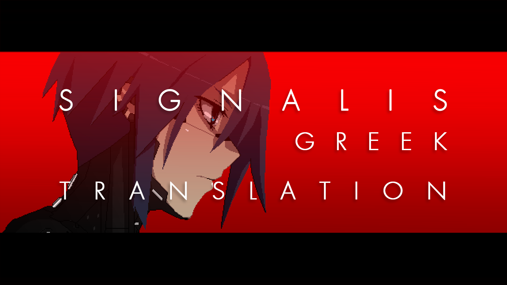

# SIGNALIS - Ελληνική Μετάφραση

Πλήρης, μη επίσημη μετάφραση του **SIGNALIS** στα ελληνικά.

Μεταφρασμένα **1.878 κείμενα**: όλοι οι διάλογοι, κάθε έγγραφο και ημερολόγιο,
όλα τα αντικείμενα, οι χάρτες και ολόκληρο το μενού του παιχνιδιού.

---

## Εγκατάσταση

Πήγαινε στα **[Releases](../../releases)** αυτού του repository και κατέβασε το
**SIGNALIS-Greek-Patcher.exe**.

1. Κλείσε το παιχνίδι
2. Τρέξε το **SIGNALIS-Greek-Patcher.exe**
3. Πάτησε **1** (Εγκατάσταση) και Enter
4. Περίμενε 1-2 λεπτά μέχρι να εμφανιστεί το **Done!**

Ο patcher βρίσκει μόνος του το παιχνίδι στο Steam. Αν δεν το βρει, θα σου ζητήσει
τον φάκελο όπου είναι εγκατεστημένο
(π.χ. `C:\Program Files (x86)\Steam\steamapps\common\SIGNALIS`).

Την πρώτη φορά τα Windows μπορεί να εμφανίσουν προειδοποίηση **SmartScreen**,
επειδή το αρχείο δεν είναι ψηφιακά υπογεγραμμένο. Πάτησε **More info → Run anyway**.

### Απεγκατάσταση

Τρέξε ξανά το **SIGNALIS-Greek-Patcher.exe** και πάτησε **2** (Επαναφορά).
Εναλλακτικά, στο Steam: **Properties → Installed Files → Verify integrity of game files**.

### Με Python (για προχωρημένους)

```bash
pip install -r requirements.txt
python patch.py              # εγκατάσταση
python patch.py --restore    # επαναφορά
python patch.py --game "D:\Games\SIGNALIS"   # αν το παιχνίδι δε βρεθεί αυτόματα
```

## Χρήση

Μέσα στο παιχνίδι:

**Settings → Language → Ελληνικά**

---

## Τι περιλαμβάνει

| Ενότητα | Καταχωρίσεις |
|---|---|
| Μενού, ρυθμίσεις, χειρισμός | 510 |
| Αντικείμενα (ονόματα, περιγραφές) | 451 |
| Παρατηρήσεις, οθόνες, σκηνές | 447 |
| Χάρτης, δωμάτια, τοποθεσίες | 239 |
| Έγγραφα, ημερολόγια, σημειώματα | 126 |
| Διάλογοι | 105 |

Το παιχνίδι δεν έχει ελληνικούς χαρακτήρες, οπότε ο patcher τούς προσθέτει στις
γραμματοσειρές του, στο ίδιο pixel στυλ με τα λατινικά γράμματα. Τα κεφαλαία
εμφανίζονται σωστά χωρίς τόνους (ΕΞΟΔΟΣ), ενώ το κανονικό κείμενο κρατάει τους
τόνους του (Έξοδος).

## Επιλογές μετάφρασης

Η μετάφραση ακολουθεί ένα σταθερό σύστημα:

- **Τα ονόματα μένουν όπως στο πρωτότυπο**: οι χαρακτήρες και τα μοντέλα Replika
  (Elster, Ariane, Isa, Falke, Kolibri, Eule, Star), οι πλανήτες και οι τοποθεσίες
  (Rotfront, Vineta, Heimat, Leng, Sierpinski).
- **Οι όροι του κόσμου του παιχνιδιού μένουν όπως είναι**: Replika, Gestalt,
  Protektor, Blockwart, Sektor, Rationmark.
- **Μετάφραση** για ό,τι περιγράφει κάτι: Κλειδί του Διαχειριστή, Ενότητα ραδιοφώνου,
  Επίθεμα επισκευής, ο Βασιλιάς με τα Κίτρινα.
- Κάποιες ρυθμίσεις μένουν στα αγγλικά, όπου τα ελληνικά θα ακούγονταν αφύσικα
  (Tank, Sticky, V-Sync, Pixel Perfect, Film Grain).
- Απλή, καθημερινή γλώσσα. Πληθυντικός ευγενείας στα μενού και στα εγχειρίδια,
  ενικός στους διαλόγους.

## Γνωστά ζητήματα

- Τα **Ελληνικά αντικαθιστούν τα Ρωσικά** στη λίστα γλωσσών του παιχνιδιού.
- Μετά από **ενημέρωση του παιχνιδιού** ή **Verify integrity of game files**, το
  παιχνίδι επιστρέφει στα αγγλικά. Τρέξε ξανά τον patcher.
- Κείμενα που είναι μέρος εικόνων (πινακίδες, αφίσες, η επικεφαλίδα PAUSE) και οι
  ετικέτες στις θέσεις των αντικειμένων παραμένουν στα αγγλικά - δεν είναι
  μεταφράσιμα από τον patcher.
- Τα κομμάτια κειμένου που εμφανίζονται σκόπιμα δυσανάγνωστα μένουν στα αγγλικά,
  αφού ούτως ή άλλως δε διαβάζονται.
- Ορισμένα κείμενα μπορεί να μη χωρούν στο πλαίσιό τους, καθώς μερικά από τα
  ελληνικά κείμενα είναι μεγαλύτερα σε έκταση από τα αγγλικά.

Η έκδοση **0.9.1** σημαίνει ότι η μετάφραση είναι πλήρης αλλά ο έλεγχος μέσα στο
παιχνίδι συνεχίζεται.

## Αναφορά προβλημάτων

Αν βρεις κάτι λάθος, αφύσικο ή κομμένο, άνοιξε ένα **issue** σε αυτό το
repository. Βοηθάει πολύ μια φωτογραφία (screenshot) και το σημείο όπου
εμφανίζεται.

## Ευχαριστίες

- **rose-engine** για το SIGNALIS
- **Poppy Works** για τη γραμματοσειρά **Silver**, πάνω στην οποία βασίζονται τα
  ελληνικά γράμματα του παιχνιδιού
- **K0lb3** για το [UnityPy](https://github.com/K0lb3/UnityPy), που κάνει δυνατή
  την επεξεργασία των αρχείων του παιχνιδιού


---

## English

An unofficial, complete Greek translation of **SIGNALIS** - 1,878 entries covering
all dialogue, every document and diary, all items, maps, and the entire user
interface. The base game ships without Greek glyphs, so the patcher adds them to
the game's own fonts in the same pixel style, with proper accent-free capitals.

Download **SIGNALIS-Greek-Patcher.exe** from [Releases](../../releases), close the
game, run it and choose **1** (Install). It finds the Steam install automatically.
Then select **Ελληνικά** under Settings → Language. Greek replaces the Russian slot.
Run it again and choose **2** to restore the original files; after a game update or
file verification, run it again to re-apply the translation.

The patcher works on the player's own copy of the game: no game files are included
in this repository. The original `data.unity3d` is backed up as
`data.unity3d.original` in the game folder.

Version 0.9.1 - the translation is complete, but in-game testing is ongoing.
Bug reports are welcome as issues on this repository; screenshots help.

### Building

```bash
pip install -r requirements.txt pyinstaller
build_exe.bat
```

The result is `dist/SIGNALIS-Greek-Patcher.exe`.

### Licences

The patcher code and the translation are MIT licensed (see `LICENSE`). No fonts or
game files are distributed: the Greek letters are added to the game's own fonts on
the player's machine.

Not affiliated with rose-engine or Humble Games. Requires a legitimate copy of the game.
